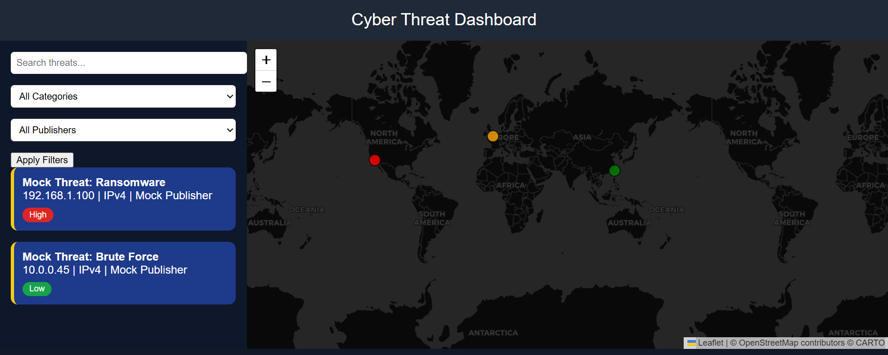
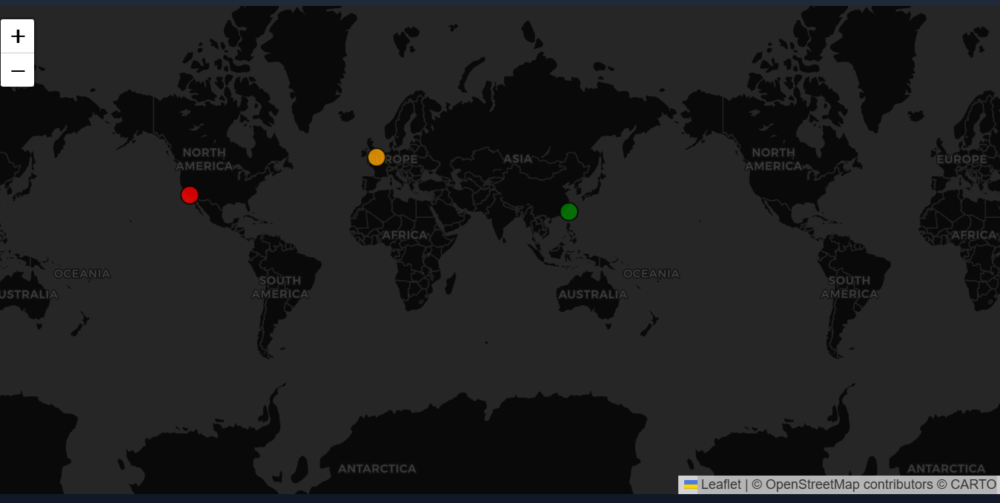

# 🛡️ Cyber Threat Intelligence Dashboard

A real-time, interactive dashboard that visualizes IPv4-based cyber threats using data from AlienVault OTX. Designed for analysts, students, and security enthusiasts to track global threat activity and gain actionable insights.

🔗 **Live Site:** [https://cyber-threat-dashboard-final.onrender.com](https://cyber-threat-dashboard-final.onrender.com)

---

## 🚀 Features

- **🗺️ Interactive Map** – Geolocates and displays threat sources on a dark-themed global map.
- **📡 Real-Time Threat Feed** – Pulls from AlienVault’s OTX API with current threat indicators.
- **🛠️ Threat Type Filtering** – Dynamically filter threats by categories (e.g., Malware, Phishing).
- **🎯 Severity Markers** – Color-coded markers represent severity: High (red), Medium (orange), Low (green).
- **❌ Threat Detail Cards** – Hover or click for detailed info including IP, location, and description.
- **🔄 Auto-Refresh** – Live dashboard refreshes automatically every few minutes.

---

## 🧱 Tech Stack

- **Frontend:** HTML, CSS, JavaScript, Bootstrap
- **Backend:** Python, Flask
- **Mapping:** Leaflet.js + OpenStreetMap
- **Geolocation API:** IP-API.com
- **Threat Intelligence API:** AlienVault OTX

---

## 📸 Screenshots

| Dashboard Map | Threat Cards |
|---------------|---------------|
|  |  |

---

## ⚙️ Installation

1. **Clone the Repository**

```bash
git clone https://github.com/securebrij/cyber-threat-dashboard-final.git
cd cyber-threat-dashboard-final
```

2. **Install Dependencies**

```bash
pip install -r requirements.txt
```

3. **Run the Application**

```bash
python app.py
```

---

## 📄 License
MIT License © 2025 Brij Patel

---

## 👨‍💻 Author

**Brij Patel**  
[](https://www.linkedin.com/in/brij-patel-6b2a77284)  
[](https://github.com/securebrij)
